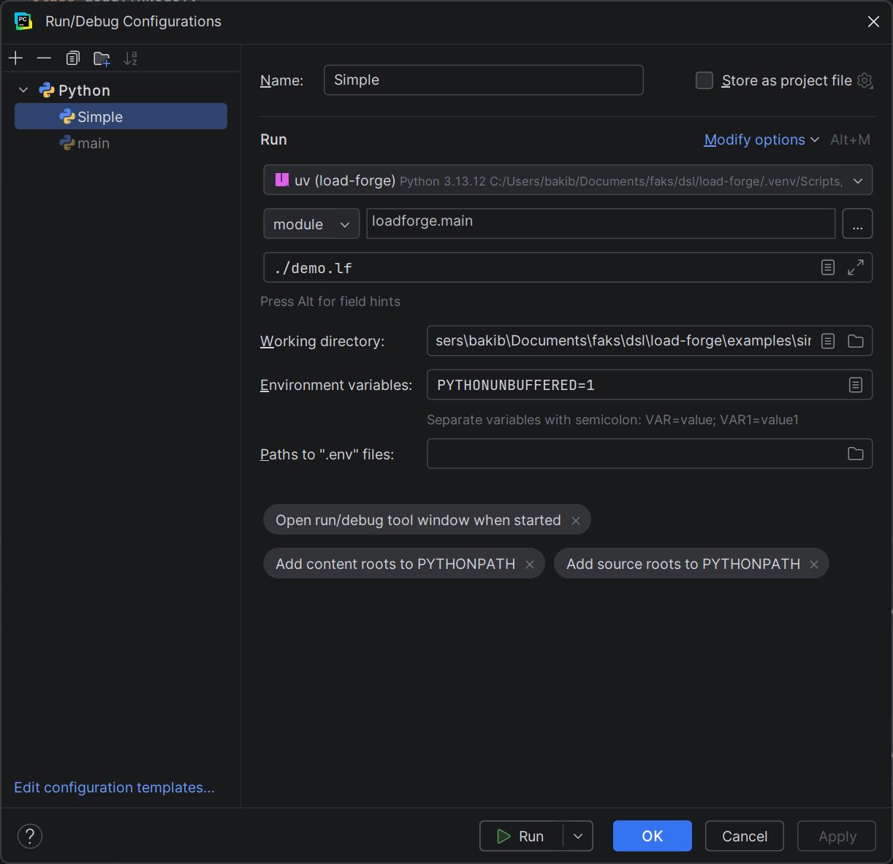

# load-forge

# development

> Use venv

```cmd
pip install -e .
loadforge ./path-to-lf-file
```

> Note: working dir should be the same as .env file which will be used by lf file

# debug with PyCharm

- `run using venv`
- `module`: `loadforge.main`
- `working directory`: `path-to-examples/simple`
- `parameters`: `./demo.lf`



# testing

```cmd
uv run pytest -v
```

# test simple example

```cmd
$ > python -m http.server 9999
$examples/simple > loadforge demo.lf
```

## Output:

```cmd
LoadForge Test Report
Test: Hello DSL
Duration: 0.279s

  ✔ PASS  search  (requests: 1)
  ✔ PASS  search again  (requests: 1)

Summary:
  Scenarios: 2
  Passed: 2
  Failed: 0
  Total requests: 2
```