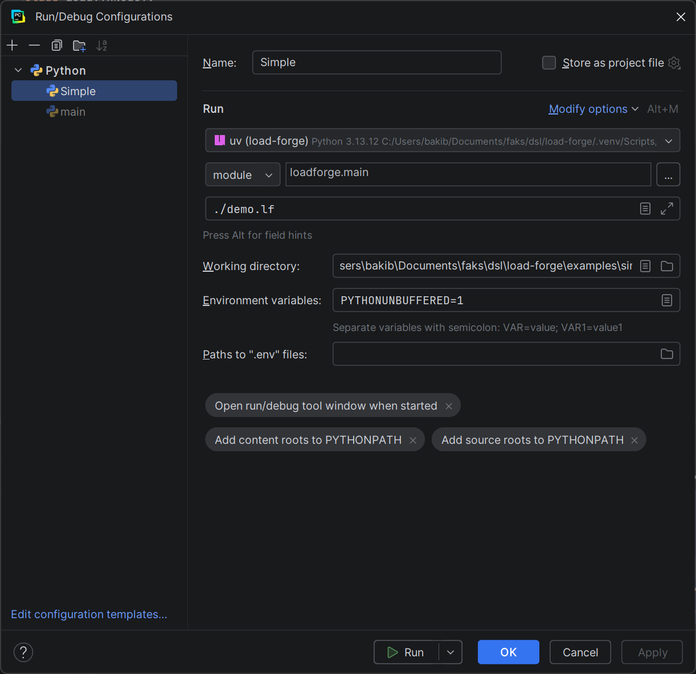

# Development

This document is focused on local development of the LoadForge project:

- installation
- CLI usage
- testing
- debugging
- build
- workflow for DSL changes

## 1. Prerequisites

- Python `3.13+`
- `uv` (recommended for dependency and run commands)

## 2. Local Installation

### Option A: `pip` editable install

```bash
python -m venv .venv
source .venv/bin/activate
pip install -e .
loadforge ./path-to-lf-file
```

### Option B: `uv` + `uv pip` editable install

```bash
uv venv
source .venv/bin/activate
uv pip install -e .
loadforge ./path-to-lf-file
```

### Option C: fully via `uv run` (no manual activation)

```bash
uv sync --dev
uv run loadforge ./path-to-lf-file
```

## 3. Running CLI

Project registers CLI command `loadforge` via:

```toml
[project.scripts]
loadforge = "loadforge.cli:main"
```

Examples:

```bash
# Run a test
uv run loadforge examples/load_demo.lf examples/.env

# Check whether file requires environment block
uv run loadforge examples/demo.lf --env-needed

# Print declared test name
uv run loadforge examples/demo.lf --name
```

Notes:

- If DSL uses `environment { ... }` and you do not pass `.env`, CLI returns an error.
- When using relative paths, ensure working directory is appropriate for `.lf`/`.env` paths.

## 4. Graceful Stop and stdin Control

CLI supports graceful stop via `CTRL+C` (SIGINT). Runtime handles interrupt, waits for in-flight requests to complete, and then exits cleanly.
It also supports `--control-stdin` mode for external stop command in enviroments that don't support process signals.
When enabled, runtime listens on stdin pipe and reacts to `STOP`.

Example:

```bash
printf "STOP\n" | uv run loadforge examples/load_demo.lf examples/.env --control-stdin
```

## 5. Testing

Run all tests:

```bash
uv run pytest -v
```

Run one file:

```bash
uv run pytest -q tests/test_metric_thresholds.py
```

Useful test groups:

- Parser/model: `tests/test_basic.py`, `tests/test_http_method_enum.py`
- Runtime/metrics: `tests/test_metrics.py`, `tests/test_metric_thresholds.py`
- Interrupt/stop: `tests/test_interrupt_handling.py`
- Auth: `tests/test_auth.py`

## 6. Local Demo Without External API

Simple smoke test:

```bash
# Terminal 1
python -m http.server 9999

# Terminal 2
cd examples
uv run loadforge functional_demo.lf .env
```

## 7. Debug (PyCharm / IDE)

Recommended run configuration:

- Module name: `loadforge.cli`
- Working directory: `.../load-forge/examples`
- Parameters: `demo.lf .env`
- Python interpreter: project/venv interpreter



## 8. Build Distribution

PyInstaller spec exists in `loadforge.spec`.

```bash
uv run pyinstaller --onefile --add-data "src/loadforge/grammar/loadforge.tx:loadforge/grammar" --name loadforge launcher.py
```

Output goes to `dist/`, temporary artifacts go to `build/`.

## 9. Adding New DSL Functionality

Minimal workflow:

1. Update grammar in `src/loadforge/grammar/loadforge.tx`.
2. Add/update model in `src/loadforge/model/*`.
3. Register classes and optional preprocessors in `src/loadforge/parser/metamodel.py`.
4. Add runtime interpretation in `src/loadforge/runtime/*`.
5. Cover parser/runtime behavior with tests in `tests/`.
6. Verify with `uv run pytest -v`.
